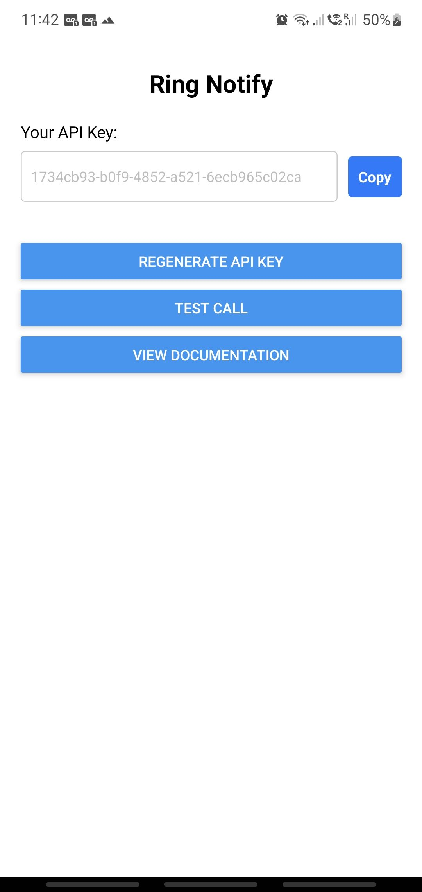
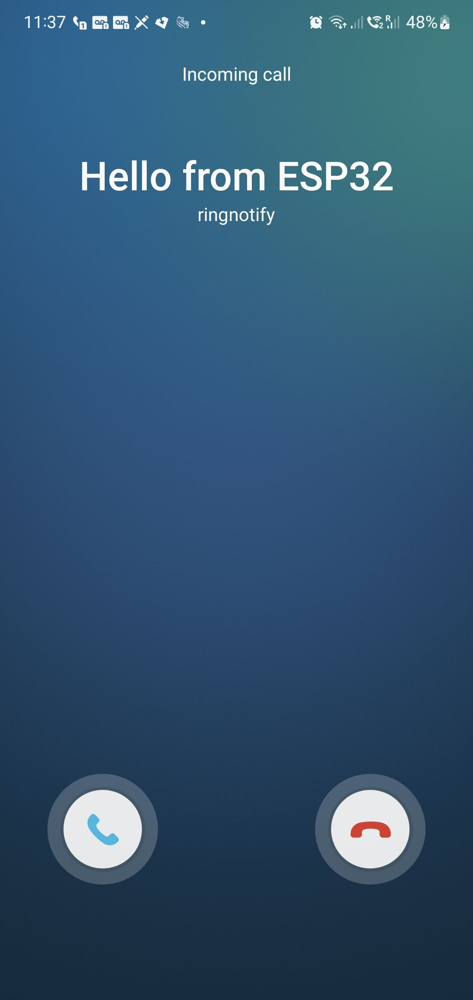

# Ring Notify

Ring Notify is an Android application (with iOS support coming soon) that allows users to send notifications to mobile phones and alert users via the phone call screen.

<div style="display: flex; justify-content: space-around;">
  
  
</div>

## Features

- **Notification Alerts**: Send notifications to mobile phones.
- **Call Screen Alerts**: Alert users via the phone call screen.
- **API Integration**: Easily integrate with the app using a REST API.

> **Note for Contributors**: Testing on iOS is welcome! The app is written using React Native, and all libraries should support iOS.

---

## Download

You can download the APK from the [GitHub Releases](https://github.com/wtarit/ring-notify/releases).

---

## Using the API

### Endpoint

Send a call notification via the following REST API:

**URL**: `https://api.ringnotify.wtarit.me/notify/call`  
**Method**: `POST`  
**Headers**:

- `Authorization: Bearer <user API key>`
- `Content-Type: application/json`

**Body**:

```json
{
  "text": "<Message that you want to show on the call screen>"
}
```
